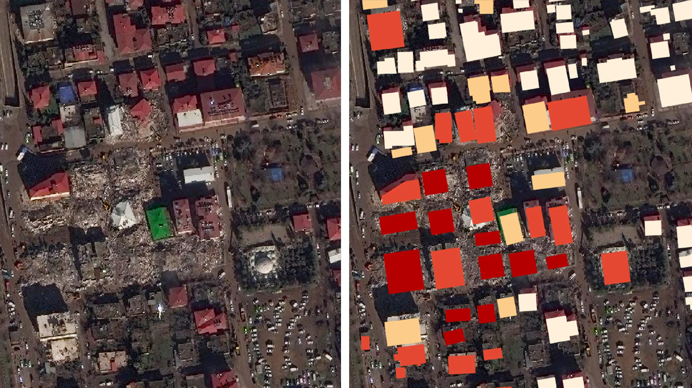
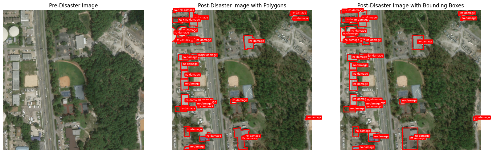
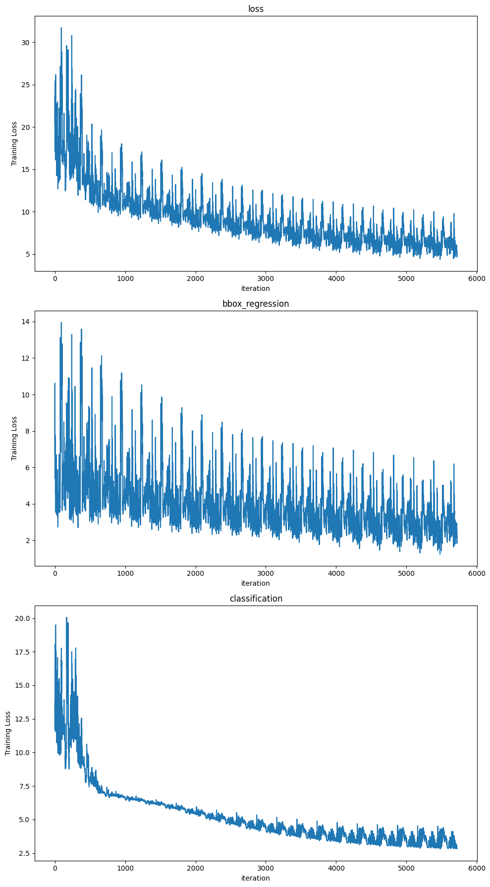

<p align="center">  </p>

<h1 align="center">DisasterVision: SSD-Based Damage Detection</h1>
<h2 align="center">(Proof Of Concept) - project under enhancement</h2>
<p align="center"> 
    DisasterVision is a deep learning framework that leverages the Single Shot MultiBox Detector (SSD) to identify disaster-induced building damage using satellite imagery. By analyzing pre- and post-disaster images, the model detects affected structures and visualizes results with bounding boxes. Designed for rapid damage assessment, it supports disaster response planning and resource allocation.
    <p align="center">  </p>
</p>

## 📝 Table of Contents

- [About](#about)
- [Installation](#installation)
- [Data Preparation](#data-preparation)
- [Training & Evaluation](#training-evaluation)
- [Author](#author)

## 🧐 About <a name="about"></a>

DisasterVision is a proof-of-concept project that transforms building damage assessment from a segmentation task into an object detection problem using bounding boxes. Built on the xView2 dataset, the framework processes pre- and post-disaster satellite imagery, visualizes annotations, and trains an SSD model for damage detection. Key features include:

- **Modular Pipeline:** Data loading, preprocessing, model training, evaluation, and visualization.
- **Extensible Design:** Compatible with other object detection architectures (e.g., Faster R-CNN, YOLO).
- **Efficiency:** Optimized training with OneCycle Learning Policy for fast convergence.

## 📦 Installation <a name="installation"></a>

### Prerequisites
- Git
- Anaconda/Miniconda

### Steps
Clone the repository:

```bash
git clone https://github.com/Chaouki-AI/DisasterVision
cd DisasterVision
chmod +x ./installEnv.sh
./installEnv.sh
conda activate DisasterVision
```

## 📂 Data Preparation <a name="data-preparation"></a>
The xView2 Dataset contains images of various disasters, including volcanoes, hurricanes, earthquakes, floods, wildfires, Southern California fires, and tsunamis, from different countries around the world.


Download the xView2 dataset from the [official website](https://xview2.org/) and organize the dataset in the following structure: 
```bash
DisasterVision/
└── data/
    ├── train/
    |      ├── images/
    |      ├── targest/
    |      └── labels/
    └── test/
           ├── images/
           ├── targest/
           └── labels/
```

Update the dataset paths in the [notebook](DisasterVision.ipynb) as needed.


## 🚀 Training & Evaluation <a name="training-evaluation"></a>

Execute the training notebook to:
 - build datalaoder via converting the orignal polygons provided by the dataset into bounding boxes as the following: 
  <p align="center">  </p>
 
 - prepare the Type of the Bonding boxes based on the universal formats (Yolo, coco, pascal_voc or albumentation) with augmentations and normalizations.
 
 - Train the SSD model after changing its input in order to accept an input with 6 channels. Three for pre-disaster and Three for post-disaster image.

 - Evaluate performance metrics
 - Visualize predictions
 - Save model checkpoints

here is an example of Training progress (Losses), for 20 epochs using OneCyle Learning policy with AdamW optimizer : 

<p align="center">  </p>


## ✍️ Author <a name="author"></a>

[M. Chaouki ZIARA](https://github.com/Chaouki-AI) is affiliated with the RCAM Laboratory, Department of Electronics, Djillali Liabes University, Sidi Bel Abbes, Algeria. (Email: chaouki.ziara@univ-sba.dz, medchaoukiziara@gmail.com) – concept creator, algorithm development, implementation, and manuscript writing.
